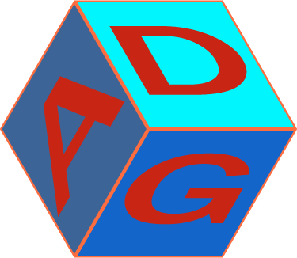

# Adventure Dice Game 

### by Floppy Projekt Green

ADG is in its concept a mix of RPG, Pen&Paper and classic board game.
The game is played on an hexagonal board that will be filled over time. Has a die based fighting system taking inspiration from old Pen&Paper games. Also there is a inspiration from RPGs with different attributes and personalization allowing for different playstyles.

The game is **round based**. The taken action in a round depends on what kind of field a player lands after his movement.

There is only one resource. With this a player can do all possible actions in the game. But one also needs to look out, because if he/she falls below 0 resource the player will die and no longer participate in the current game.

Additional information is avaliable on the [wiki](https://github.com/floppyprojektgreen/ADG/wiki).

### Releases
- [latest release](https://github.com/floppyprojektgreen/ADG/releases/latest)
- [older releases](https://github.com/floppyprojektgreen/ADG/releases)
